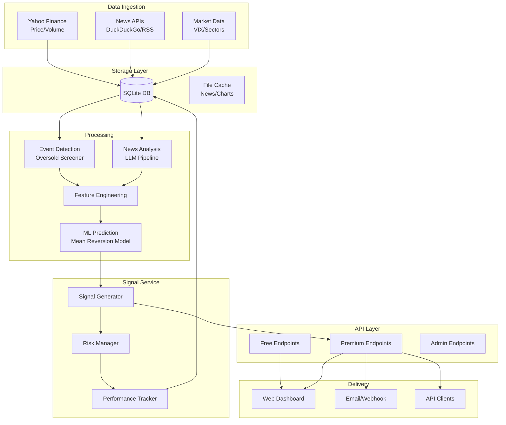

# Mean Reversion Trading Signal Feature - Technical Specification

## Table of Contents
1. [Executive Summary](#executive-summary)
2. [System Overview](#system-overview)
3. [Data Architecture](#data-architecture)
4. [Technical Architecture](#technical-architecture)
5. [Database Schema](#database-schema)
6. [API Specifications](#api-specifications)
7. [ML Pipeline](#ml-pipeline)
8. [Feature Engineering](#feature-engineering)
9. [Signal Generation Logic](#signal-generation-logic)
10. [Authentication & Authorization](#authentication--authorization)
11. [Performance & Scalability](#performance--scalability)
12. [Implementation Roadmap](#implementation-roadmap)
13. [Risk Management](#risk-management)
14. [Monitoring & Observability](#monitoring--observability)

## Executive Summary

### Objective
Build a premium feature that identifies stocks experiencing news-driven oversold conditions with high mean-reversion probability. The system combines structured news analysis via LLM with market microstructure signals to generate actionable trading opportunities.

### Key Capabilities
- Real-time detection of oversold conditions across 500+ stocks
- LLM-powered news event classification and severity assessment
- Machine learning-based mean reversion probability prediction
- Automated signal generation with entry/exit recommendations
- Performance tracking and paper trading simulation
- Multi-tier subscription model with API access

### Technology Stack
- **Backend**: FastAPI (existing) + SQLAlchemy + SQLite
- **Data Sources**: Yahoo Finance, DuckDuckGo News, FRED, Wikipedia
- **ML**: scikit-learn, XGBoost, LightGBM
- **Task Queue**: asyncio + APScheduler (lightweight alternative to Celery)
- **Authentication**: JWT + Stripe for payments
- **Monitoring**: Structured logging + Prometheus metrics

## System Overview



## Data Architecture

### Migration from Filesystem to SQLite

#### Current State
- News cache: `backend/.cache/news/` (JSON files)
- No persistent storage for quotes/charts (in-memory only)
- No historical tracking

#### Target State
- SQLite database: `backend/data/stockdrop.db`
- Structured tables for all data types
- Efficient querying and historical analysis
- Maintains file cache for large objects (images, full articles)

### Data Flow

1. **Ingestion** (15-minute intervals)
   - Price/volume data from Yahoo Finance
   - News headlines via existing DuckDuckGo search
   - Market indicators (VIX, sector performance)

2. **Processing** (Event-driven)
   - Oversold detection triggers on price/volume anomalies
   - News analysis via LLM for triggered symbols
   - Feature computation and ML prediction
   - Signal generation with risk parameters

3. **Storage**
   - All raw data → SQLite tables
   - Computed features → feature store tables
   - Generated signals → signals table
   - Performance tracking → performance tables

## Technical Architecture

### Component Breakdown

#### 1. Data Collectors
```python
# backend/collectors/
├── price_collector.py      # Yahoo Finance integration
├── news_collector.py       # Enhanced news search
├── market_collector.py     # VIX, sectors, market breadth
└── base_collector.py       # Abstract collector interface
```

#### 2. Database Layer
```python
# backend/database/
├── models.py              # SQLAlchemy models
├── connection.py          # Database connection manager
├── migrations.py          # Schema migrations
└── repositories/          # Data access patterns
    ├── price_repo.py
    ├── news_repo.py
    ├── signal_repo.py
    └── user_repo.py
```

#### 3. Analysis Engine
```python
# backend/analysis/
├── oversold_detector.py   # Market microstructure analysis
├── news_analyzer.py       # LLM-powered news structuring
├── feature_engine.py      # Feature computation
├── ml_predictor.py        # Mean reversion prediction
└── signal_generator.py    # Trading signal creation
```

#### 4. Premium Features
```python
# backend/premium/
├── auth.py               # JWT authentication
├── subscription.py       # Stripe integration
├── rate_limiter.py       # Usage limits
└── alerts.py             # Email/webhook delivery
```

### Service Architecture

#### Background Tasks
- **Market Scanner** (every 15 min during market hours)
  - Fetches latest prices for tracked symbols
  - Computes oversold metrics
  - Triggers deeper analysis for candidates

- **News Monitor** (continuous)
  - Polls for news on oversold candidates
  - Maintains news freshness

- **Signal Updater** (every 5 min)
  - Updates open signal performance
  - Checks exit conditions
  - Archives completed signals

#### API Services
- **Public API** (existing endpoints)
- **Premium API** (new endpoints, JWT required)
- **Admin API** (internal metrics, manual overrides)

## Database Schema

### Core Tables

```sql
-- Users and subscriptions
CREATE TABLE users (
    id INTEGER PRIMARY KEY,
    email TEXT UNIQUE NOT NULL,
    created_at TIMESTAMP DEFAULT CURRENT_TIMESTAMP,
    stripe_customer_id TEXT,
    subscription_tier TEXT CHECK(subscription_tier IN ('free', 'hobbyist', 'trader', 'professional')),
    subscription_status TEXT CHECK(subscription_status IN ('active', 'cancelled', 'past_due')),
    subscription_expires_at TIMESTAMP
);

-- Price and volume data
CREATE TABLE price_data (
    id INTEGER PRIMARY KEY,
    symbol TEXT NOT NULL,
    timestamp TIMESTAMP NOT NULL,
    open REAL,
    high REAL,
    low REAL,
    close REAL NOT NULL,
    volume INTEGER,
    source TEXT NOT NULL,
    created_at TIMESTAMP DEFAULT CURRENT_TIMESTAMP,
    UNIQUE(symbol, timestamp, source)
);

-- News and events
CREATE TABLE news_events (
    id INTEGER PRIMARY KEY,
    symbol TEXT NOT NULL,
    headline TEXT NOT NULL,
    url TEXT,
    source TEXT,
    published_at TIMESTAMP,
    content_snippet TEXT,
    created_at TIMESTAMP DEFAULT CURRENT_TIMESTAMP,
    INDEX idx_symbol_published (symbol, published_at)
);

-- LLM analysis results
CREATE TABLE news_analysis (
    id INTEGER PRIMARY KEY,
    news_event_id INTEGER REFERENCES news_events(id),
    event_type TEXT,
    severity TEXT CHECK(severity IN ('minor', 'moderate', 'severe')),
    time_horizon TEXT CHECK(time_horizon IN ('days', 'quarters', 'permanent')),
    company_specific BOOLEAN,
    revenue_impact_pct REAL,
    earnings_impact_pct REAL,
    credibility_score REAL,
    novelty_score REAL,
    analysis_json TEXT,  -- Full structured output
    llm_model TEXT,
    created_at TIMESTAMP DEFAULT CURRENT_TIMESTAMP
);

-- Market indicators
CREATE TABLE market_indicators (
    id INTEGER PRIMARY KEY,
    indicator_name TEXT NOT NULL,
    timestamp TIMESTAMP NOT NULL,
    value REAL NOT NULL,
    created_at TIMESTAMP DEFAULT CURRENT_TIMESTAMP,
    UNIQUE(indicator_name, timestamp)
);

-- Computed features
CREATE TABLE computed_features (
    id INTEGER PRIMARY KEY,
    symbol TEXT NOT NULL,
    timestamp TIMESTAMP NOT NULL,
    feature_set TEXT NOT NULL,  -- 'oversold_v1', 'ml_features_v1', etc.
    features_json TEXT NOT NULL,  -- JSON blob of all features
    created_at TIMESTAMP DEFAULT CURRENT_TIMESTAMP,
    INDEX idx_symbol_timestamp (symbol, timestamp)
);

-- Trading signals
CREATE TABLE trading_signals (
    id TEXT PRIMARY KEY,  -- UUID
    symbol TEXT NOT NULL,
    signal_type TEXT NOT NULL,
    created_at TIMESTAMP DEFAULT CURRENT_TIMESTAMP,
    expires_at TIMESTAMP,
    
    -- Entry parameters
    entry_price REAL NOT NULL,
    current_price REAL NOT NULL,
    target_price REAL NOT NULL,
    stop_loss_price REAL NOT NULL,
    position_size_pct REAL,
    
    -- Signal metadata
    confidence_score REAL NOT NULL,
    oversold_score REAL NOT NULL,
    news_score REAL,
    ml_prediction REAL,
    
    -- Analysis data
    triggering_event_id INTEGER REFERENCES news_events(id),
    analysis_summary TEXT,
    features_json TEXT,
    
    -- Status tracking
    status TEXT CHECK(status IN ('active', 'expired', 'stopped_out', 'target_reached', 'manually_closed')),
    closed_at TIMESTAMP,
    exit_price REAL,
    realized_pnl_pct REAL,
    
    INDEX idx_active_signals (status, symbol),
    INDEX idx_created_at (created_at DESC)
);

-- Signal performance tracking
CREATE TABLE signal_performance (
    id INTEGER PRIMARY KEY,
    signal_id TEXT REFERENCES trading_signals(id),
    timestamp TIMESTAMP NOT NULL,
    price REAL NOT NULL,
    unrealized_pnl_pct REAL NOT NULL,
    days_held INTEGER NOT NULL,
    created_at TIMESTAMP DEFAULT CURRENT_TIMESTAMP
);

-- User alerts and preferences
CREATE TABLE user_alerts (
    id INTEGER PRIMARY KEY,
    user_id INTEGER REFERENCES users(id),
    alert_type TEXT CHECK(alert_type IN ('email', 'webhook')),
    destination TEXT NOT NULL,  -- email address or webhook URL
    filters_json TEXT,  -- JSON criteria for alerts
    is_active BOOLEAN DEFAULT TRUE,
    created_at TIMESTAMP DEFAULT CURRENT_TIMESTAMP
);

-- API usage tracking
CREATE TABLE api_usage (
    id INTEGER PRIMARY KEY,
    user_id INTEGER REFERENCES users(id),
    endpoint TEXT NOT NULL,
    timestamp TIMESTAMP DEFAULT CURRENT_TIMESTAMP,
    response_time_ms INTEGER,
    status_code INTEGER
);
```

### Indexes for Performance
```sql
-- Price queries
CREATE INDEX idx_price_symbol_time ON price_data(symbol, timestamp DESC);

-- News queries  
CREATE INDEX idx_news_symbol_time ON news_events(symbol, published_at DESC);

-- Signal queries
CREATE INDEX idx_signals_active ON trading_signals(status) WHERE status = 'active';
CREATE INDEX idx_signals_user_perf ON trading_signals(created_at DESC, realized_pnl_pct);

-- Feature lookups
CREATE INDEX idx_features_lookup ON computed_features(symbol, timestamp DESC, feature_set);
```

## API Specifications

### Authentication
All premium endpoints require JWT token in Authorization header:
```
Authorization: Bearer <jwt_token>
```

### Premium Endpoints

#### 1. Get Active Signals
```http
GET /api/premium/signals/active?limit=20&min_confidence=0.7
Authorization: Bearer <token>

Response:
{
  "signals": [
    {
      "id": "550e8400-e29b-41d4-a716-446655440000",
      "symbol": "AAPL",
      "created_at": "2024-01-15T14:30:00Z",
      "entry_price": 180.50,
      "current_price": 181.25,
      "target_price": 184.50,
      "stop_loss_price": 178.00,
      "confidence_score": 0.82,
      "unrealized_pnl_pct": 0.42,
      "analysis_summary": "Overreaction to supply chain concerns...",
      "days_held": 2
    }
  ],
  "total": 5
}
```

#### 2. Get Signal Details
```http
GET /api/premium/signals/{signal_id}
Authorization: Bearer <token>

Response:
{
  "signal": {
    "id": "550e8400-e29b-41d4-a716-446655440000",
    "symbol": "AAPL",
    // ... base signal data ...
    "oversold_metrics": {
      "price_z_score": -2.8,
      "volume_percentile": 0.95,
      "gap_size": -0.055
    },
    "news_analysis": {
      "event_type": "supply_chain",
      "severity": "moderate",
      "time_horizon": "quarters",
      "credibility_score": 0.75
    },
    "triggering_news": {
      "headline": "Apple faces component shortage...",
      "source": "Reuters",
      "published_at": "2024-01-15T08:00:00Z"
    },
    "performance_history": [
      {
        "timestamp": "2024-01-15T14:30:00Z",
        "price": 180.50,
        "pnl_pct": 0.0
      },
      {
        "timestamp": "2024-01-16T14:30:00Z",
        "price": 181.25,
        "pnl_pct": 0.42
      }
    ]
  }
}
```

#### 3. Historical Performance
```http
GET /api/premium/performance?period=30d&grouping=daily
Authorization: Bearer <token>

Response:
{
  "performance": {
    "period": "30d",
    "total_signals": 47,
    "win_rate": 0.68,
    "average_return": 0.023,
    "sharpe_ratio": 1.82,
    "max_drawdown": -0.045,
    "daily_returns": [
      {
        "date": "2024-01-15",
        "signal_count": 3,
        "realized_pnl": 0.018,
        "win_rate": 0.67
      }
    ]
  }
}
```

#### 4. Subscribe to Alerts
```http
POST /api/premium/alerts/subscribe
Authorization: Bearer <token>
Content-Type: application/json

{
  "alert_type": "webhook",
  "destination": "https://myapp.com/webhook",
  "filters": {
    "min_confidence": 0.75,
    "sectors": ["technology", "healthcare"],
    "min_market_cap": 1000000000
  }
}

Response:
{
  "alert_id": "alert_123",
  "status": "active"
}
```

#### 5. Generate Custom Signals (Pro tier)
```http
POST /api/premium/signals/scan
Authorization: Bearer <token>
Content-Type: application/json

{
  "symbols": ["AAPL", "GOOGL", "MSFT"],
  "lookback_days": 5,
  "oversold_threshold": -2.5,
  "min_volume_percentile": 0.9
}

Response:
{
  "scan_id": "scan_456",
  "status": "processing",
  "estimated_time": 30
}
```

### Webhook Format
```json
{
  "event": "new_signal",
  "timestamp": "2024-01-15T14:30:00Z",
  "signal": {
    "id": "550e8400-e29b-41d4-a716-446655440000",
    "symbol": "AAPL",
    "action": "BUY",
    "entry_price": 180.50,
    "target_price": 184.50,
    "stop_loss_price": 178.00,
    "confidence_score": 0.82,
    "analysis_summary": "Overreaction to supply chain concerns..."
  }
}
```

## ML Pipeline

### Feature Categories

#### 1. Price-Based Features (15 features)
```python
price_features = {
    # Returns
    "return_1d": (close - close_1d) / close_1d,
    "return_3d": (close - close_3d) / close_3d,
    "return_5d": (close - close_5d) / close_5d,
    
    # Volatility
    "realized_vol_5d": std(returns_5d),
    "garman_klass_vol": sqrt(sum((log(high/low))^2) / n),
    
    # Technical indicators
    "rsi_14": calculate_rsi(close, 14),
    "distance_from_sma20": (close - sma20) / sma20,
    "bollinger_position": (close - bb_lower) / (bb_upper - bb_lower),
    
    # Microstructure
    "volume_ratio": volume / avg_volume_20d,
    "dollar_volume": close * volume,
    "amihud_illiquidity": abs(return) / dollar_volume,
    
    # Gap and range
    "overnight_gap": (open - prev_close) / prev_close,
    "intraday_range": (high - low) / open,
    "close_to_low": (close - low) / (high - low)
}
```

#### 2. News-Based Features (12 features)
```python
news_features = {
    # Event characteristics
    "event_type_encoded": one_hot_encode(event_type),
    "severity_score": map_severity_to_numeric(severity),
    "time_horizon_days": map_horizon_to_days(time_horizon),
    
    # Credibility and novelty
    "source_credibility": source_tier_score,
    "confirmation_count": num_similar_articles,
    "novelty_score": 1 - max_similarity_to_past_events,
    
    # Quantitative content
    "has_numbers": bool(revenue_impact or earnings_impact),
    "max_impact_magnitude": max(abs(revenue_impact), abs(earnings_impact)),
    
    # Temporal
    "hours_since_news": (now - news_published_at).hours,
    "news_during_market": is_market_hours(news_published_at),
    
    # Sentiment
    "headline_sentiment": sentiment_score,
    "mgmt_responded": bool(management_statement)
}
```

#### 3. Market Regime Features (5 features)
```python
market_features = {
    "vix_level": current_vix,
    "vix_percentile": percentile_rank(current_vix, 252),
    "market_trend": sma_spy_50 > sma_spy_200,
    "sector_relative_strength": sector_return - market_return,
    "market_breadth": advancing_issues / total_issues
}
```

#### 4. Historical Similarity Features (5 features)
```python
similarity_features = {
    "similar_events_count": len(find_similar_events(embedding, threshold=0.8)),
    "avg_similar_event_return": mean([e.forward_return for e in similar_events]),
    "similar_event_win_rate": sum([e.forward_return > 0 for e in similar_events]) / len(similar_events),
    "days_since_similar": (now - most_recent_similar.date).days,
    "company_event_frequency": count_company_events(symbol, 252) / 252
}
```

### Model Architecture

#### Primary Model: XGBoost Ensemble
```python
# Three models for different time horizons
models = {
    "short_term": XGBRegressor(  # 5-day return prediction
        n_estimators=200,
        max_depth=5,
        learning_rate=0.05,
        subsample=0.8,
        colsample_bytree=0.8
    ),
    "medium_term": XGBRegressor(  # 10-day return prediction
        n_estimators=300,
        max_depth=6,
        learning_rate=0.03
    ),
    "reversion_probability": XGBClassifier(  # Binary: reaches +3% before -3%
        n_estimators=250,
        max_depth=5,
        scale_pos_weight=2  # Handle class imbalance
    )
}
```

#### Training Pipeline
```python
def train_models(start_date, end_date):
    # 1. Load historical events
    events = load_oversold_events(start_date, end_date)
    
    # 2. Compute features for each event
    features = compute_all_features(events)
    
    # 3. Calculate forward returns
    targets = calculate_forward_returns(events, [5, 10, 20])
    
    # 4. Time series split (no lookahead)
    splits = TimeSeriesSplit(n_splits=5, gap=20)  # 20-day gap
    
    # 5. Train with walk-forward validation
    for train_idx, val_idx in splits.split(features):
        X_train, X_val = features[train_idx], features[val_idx]
        y_train, y_val = targets[train_idx], targets[val_idx]
        
        # Purge overlapping samples
        X_train, y_train = purge_overlap(X_train, y_train, val_idx[0])
        
        # Train models
        for model_name, model in models.items():
            model.fit(X_train, y_train[model_name])
            
    return models
```

### Backtesting Framework
```python
class MeanReversionBacktest:
    def __init__(self, models, start_date, end_date):
        self.models = models
        self.start_date = start_date
        self.end_date = end_date
        
    def run(self):
        results = []
        
        for date in trading_days(start_date, end_date):
            # Get oversold candidates
            candidates = detect_oversold(date)
            
            # Generate signals
            signals = []
            for symbol in candidates:
                features = compute_features(symbol, date)
                prediction = self.models.predict(features)
                
                if prediction['confidence'] > 0.7:
                    signal = generate_signal(symbol, prediction)
                    signals.append(signal)
            
            # Simulate execution
            for signal in signals:
                # Add execution delay
                entry_price = get_price_at(
                    signal.symbol, 
                    date + timedelta(minutes=5)
                )
                
                # Track position
                position = Position(signal, entry_price)
                results.append(position)
        
        return BacktestResults(results)
```

## Feature Engineering

### Real-time Feature Computation
```python
class FeatureEngine:
    def __init__(self, db_connection):
        self.db = db_connection
        self.feature_cache = TTLCache(maxsize=1000, ttl=300)
        
    async def compute_features(self, symbol: str, timestamp: datetime) -> dict:
        # Check cache first
        cache_key = f"{symbol}:{timestamp.isoformat()}"
        if cache_key in self.feature_cache:
            return self.feature_cache[cache_key]
        
        # Compute in parallel
        tasks = [
            self.compute_price_features(symbol, timestamp),
            self.compute_news_features(symbol, timestamp),
            self.compute_market_features(timestamp),
            self.compute_similarity_features(symbol, timestamp)
        ]
        
        results = await asyncio.gather(*tasks)
        
        features = {
            **results[0],  # price features
            **results[1],  # news features
            **results[2],  # market features
            **results[3]   # similarity features
        }
        
        # Cache and store
        self.feature_cache[cache_key] = features
        await self.store_features(symbol, timestamp, features)
        
        return features
```

### Feature Versioning
```python
FEATURE_VERSIONS = {
    "oversold_v1": {
        "features": ["return_1d", "volume_ratio", "rsi_14"],
        "version": "1.0.0",
        "created": "2024-01-15"
    },
    "ml_features_v1": {
        "features": [...],  # Full feature list
        "version": "1.0.0",
        "model_compatible": ["xgb_v1", "lgb_v1"]
    }
}
```

## Signal Generation Logic

### Signal Creation Flow
```python
class SignalGenerator:
    def __init__(self, models, risk_manager):
        self.models = models
        self.risk_manager = risk_manager
        
    async def generate_signal(self, symbol: str, features: dict) -> Optional[TradingSignal]:
        # 1. Get predictions from all models
        predictions = {}
        for name, model in self.models.items():
            predictions[name] = model.predict_proba(features)[0][1]
        
        # 2. Calculate composite score
        confidence = self.calculate_confidence(predictions)
        
        # 3. Check minimum thresholds
        if confidence < 0.7:
            return None
            
        if features['oversold_score'] < 2.5:
            return None
        
        # 4. Determine position parameters
        current_price = await self.get_current_price(symbol)
        
        # Dynamic targets based on volatility
        atr = features['atr_20']
        target_multiple = 2.0 if predictions['reversion_probability'] > 0.8 else 1.5
        stop_multiple = 1.5
        
        target_price = current_price + (atr * target_multiple)
        stop_loss = current_price - (atr * stop_multiple)
        
        # 5. Risk management checks
        position_size = self.risk_manager.calculate_position_size(
            confidence=confidence,
            volatility=features['realized_vol_5d'],
            correlation_to_existing=await self.calculate_correlation(symbol)
        )
        
        if position_size == 0:
            return None
        
        # 6. Create signal
        signal = TradingSignal(
            id=str(uuid.uuid4()),
            symbol=symbol,
            signal_type="mean_reversion",
            created_at=datetime.utcnow(),
            expires_at=datetime.utcnow() + timedelta(days=5),
            entry_price=current_price,
            target_price=target_price,
            stop_loss_price=stop_loss,
            position_size_pct=position_size,
            confidence_score=confidence,
            oversold_score=features['oversold_score'],
            ml_prediction=predictions['short_term'],
            analysis_summary=await self.generate_summary(symbol, features, predictions)
        )
        
        return signal
```

### Risk Management
```python
class RiskManager:
    def __init__(self, max_positions=10, max_position_size=0.1, max_sector_exposure=0.3):
        self.max_positions = max_positions
        self.max_position_size = max_position_size
        self.max_sector_exposure = max_sector_exposure
        
    def calculate_position_size(self, confidence, volatility, correlation_to_existing):
        # Base size from Kelly Criterion (simplified)
        base_size = (confidence - 0.5) * 2  # Maps 0.7 conf to 0.4 size
        
        # Adjust for volatility (inverse relationship)
        vol_adjustment = 1 / (1 + volatility * 10)
        
        # Reduce if correlated to existing positions
        correlation_penalty = 1 - (correlation_to_existing * 0.5)
        
        # Final size
        size = base_size * vol_adjustment * correlation_penalty
        
        # Apply caps
        size = min(size, self.max_position_size)
        
        # Check portfolio constraints
        if not self.check_constraints(size):
            return 0
            
        return round(size, 3)
```

## Authentication & Authorization

### JWT Implementation
```python
# backend/premium/auth.py
from datetime import datetime, timedelta
from typing import Optional
import jwt
from fastapi import HTTPException, Security
from fastapi.security import HTTPBearer, HTTPAuthorizationCredentials

class AuthHandler:
    security = HTTPBearer()
    secret = os.getenv("JWT_SECRET", "your-secret-key")
    
    def encode_token(self, user_id: int, tier: str) -> str:
        payload = {
            "exp": datetime.utcnow() + timedelta(days=30),
            "iat": datetime.utcnow(),
            "sub": str(user_id),
            "tier": tier
        }
        return jwt.encode(payload, self.secret, algorithm="HS256")
    
    def decode_token(self, token: str) -> dict:
        try:
            payload = jwt.decode(token, self.secret, algorithms=["HS256"])
            return payload
        except jwt.ExpiredSignatureError:
            raise HTTPException(401, "Token expired")
        except jwt.InvalidTokenError:
            raise HTTPException(401, "Invalid token")
    
    def auth_wrapper(self, auth: HTTPAuthorizationCredentials = Security(security)):
        return self.decode_token(auth.credentials)
```

### Subscription Tiers
```python
SUBSCRIPTION_TIERS = {
    "free": {
        "signals_per_month": 0,
        "api_calls_per_day": 10,
        "features": ["basic_analysis"]
    },
    "hobbyist": {
        "price": 49,
        "signals_per_month": 10,
        "api_calls_per_day": 100,
        "features": ["signals", "email_alerts", "basic_dashboard"]
    },
    "trader": {
        "price": 199,
        "signals_per_month": -1,  # unlimited
        "api_calls_per_day": 1000,
        "features": ["signals", "alerts", "full_dashboard", "historical_data"]
    },
    "professional": {
        "price": 499,
        "signals_per_month": -1,
        "api_calls_per_day": 10000,
        "features": ["everything", "api_access", "custom_alerts", "white_label"]
    }
}
```

### Stripe Integration
```python
# backend/premium/subscription.py
import stripe

class SubscriptionManager:
    def __init__(self):
        stripe.api_key = os.getenv("STRIPE_SECRET_KEY")
        
    async def create_checkout_session(self, user_id: int, tier: str):
        price_id = STRIPE_PRICE_IDS[tier]
        
        session = stripe.checkout.Session.create(
            payment_method_types=["card"],
            line_items=[{
                "price": price_id,
                "quantity": 1
            }],
            mode="subscription",
            success_url=f"{BASE_URL}/subscription/success?session_id={{CHECKOUT_SESSION_ID}}",
            cancel_url=f"{BASE_URL}/subscription/cancelled",
            metadata={
                "user_id": str(user_id),
                "tier": tier
            }
        )
        
        return session.id
```

## Performance & Scalability

### Caching Strategy
```python
# Multi-level caching
CACHE_CONFIG = {
    "memory": {
        "features": TTLCache(maxsize=10000, ttl=300),
        "signals": TTLCache(maxsize=1000, ttl=60),
        "quotes": TTLCache(maxsize=5000, ttl=60)
    },
    "database": {
        "expensive_computations": 3600,  # 1 hour
        "ml_predictions": 900  # 15 minutes
    }
}
```

### Database Optimization
```python
# Connection pooling
engine = create_engine(
    "sqlite:///backend/data/stockdrop.db",
    connect_args={
        "check_same_thread": False,
        "timeout": 30
    },
    pool_size=10,
    max_overflow=20
)

# Write-ahead logging for concurrent reads
with engine.connect() as conn:
    conn.execute("PRAGMA journal_mode=WAL")
    conn.execute("PRAGMA synchronous=NORMAL")
```

### Async Processing
```python
# Use asyncio for concurrent operations
async def process_oversold_batch(symbols: list[str]):
    tasks = []
    
    for symbol in symbols:
        tasks.append(analyze_symbol(symbol))
    
    # Process in batches to avoid overwhelming APIs
    batch_size = 10
    results = []
    
    for i in range(0, len(tasks), batch_size):
        batch = tasks[i:i + batch_size]
        batch_results = await asyncio.gather(*batch)
        results.extend(batch_results)
        
        # Rate limiting
        await asyncio.sleep(1)
    
    return results
```

## Implementation Roadmap

### Phase 1: Foundation (Week 1-2)
- [ ] Set up SQLite database with initial schema
- [ ] Create data models with SQLAlchemy
- [ ] Build data collectors for Yahoo Finance and market indicators
- [ ] Implement basic oversold detection logic
- [ ] Create feature computation pipeline

### Phase 2: ML Development (Week 3-4)
- [ ] Collect historical data for training
- [ ] Implement feature engineering pipeline
- [ ] Train initial XGBoost models
- [ ] Build backtesting framework
- [ ] Validate model performance

### Phase 3: Signal Generation (Week 5-6)
- [ ] Implement signal generation logic
- [ ] Add risk management rules
- [ ] Create performance tracking system
- [ ] Build paper trading simulator
- [ ] Test end-to-end signal flow

### Phase 4: API & Auth (Week 7)
- [ ] Implement JWT authentication
- [ ] Create premium API endpoints
- [ ] Add rate limiting
- [ ] Integrate Stripe for payments
- [ ] Build usage tracking

### Phase 5: Frontend (Week 8)
- [ ] Design premium dashboard UI
- [ ] Create signal display components
- [ ] Add performance charts
- [ ] Implement alert preferences
- [ ] Build subscription management

### Phase 6: Production (Week 9-10)
- [ ] Add comprehensive logging
- [ ] Implement monitoring
- [ ] Performance optimization
- [ ] Security audit
- [ ] Deploy to production

## Risk Management

### Technical Risks
1. **Data Quality**
   - Mitigation: Multiple data sources, validation checks
   - Fallback: Graceful degradation when data missing

2. **Model Overfitting**
   - Mitigation: Proper train/test splits, regularization
   - Monitoring: Live performance vs backtest tracking

3. **Latency Issues**
   - Mitigation: Aggressive caching, async processing
   - Target: < 5 second signal generation

### Business Risks
1. **Regulatory Compliance**
   - Clear disclaimers about not being investment advice
   - Terms of service limiting liability
   - No guaranteed returns claims

2. **Customer Expectations**
   - Transparent performance reporting
   - Education about probabilistic nature
   - Clear communication about data delays

## Monitoring & Observability

### Key Metrics
```python
# Prometheus metrics
signal_generation_time = Histogram('signal_generation_seconds')
active_signals_count = Gauge('active_signals_total')
prediction_accuracy = Gauge('model_prediction_accuracy')
api_request_duration = Histogram('api_request_duration_seconds')
subscription_revenue = Gauge('subscription_revenue_usd')
```

### Logging Structure
```python
import structlog

logger = structlog.get_logger()

# Structured logging for analysis
logger.info(
    "signal_generated",
    symbol=symbol,
    confidence=confidence,
    oversold_score=oversold_score,
    expected_return=expected_return,
    user_tier=user_tier
)
```

### Alerting Rules
```yaml
# Prometheus alerts
groups:
  - name: trading_signals
    rules:
      - alert: HighSignalGenerationTime
        expr: signal_generation_seconds > 10
        for: 5m
        annotations:
          summary: "Signal generation taking too long"
          
      - alert: LowPredictionAccuracy
        expr: model_prediction_accuracy < 0.6
        for: 1h
        annotations:
          summary: "Model accuracy below threshold"
```

## Frontend Architecture & UI Design

### Overview
The frontend requires substantial updates to support premium features while maintaining the existing free functionality. We'll implement a freemium model with clear upgrade paths and premium feature gates.

### Component Architecture

```
frontend/src/
├── components/
│   ├── premium/
│   │   ├── SignalDashboard.jsx       # Main premium dashboard
│   │   ├── SignalCard.jsx            # Individual signal display
│   │   ├── SignalDetails.jsx         # Detailed signal view
│   │   ├── PerformanceChart.jsx      # Historical performance
│   │   ├── PositionTracker.jsx       # Active positions
│   │   ├── AlertSettings.jsx         # Notification preferences
│   │   └── SubscriptionManager.jsx   # Billing & plan management
│   ├── auth/
│   │   ├── LoginModal.jsx            # Authentication
│   │   ├── SignupFlow.jsx            # Registration + plan selection
│   │   └── AuthContext.jsx           # Auth state management
│   └── common/
│       ├── PaywallGate.jsx           # Premium feature gate
│       ├── UpgradePrompt.jsx         # Inline upgrade CTAs
│       └── PricingTable.jsx          # Plan comparison
├── hooks/
│   ├── useAuth.js                    # Authentication hook
│   ├── useSubscription.js            # Subscription state
│   ├── usePremiumData.js             # Premium API calls
│   └── useWebSocket.js               # Real-time updates
├── services/
│   ├── authService.js                # JWT management
│   ├── premiumApi.js                 # Premium endpoints
│   └── stripeService.js              # Payment handling
└── stores/
    ├── signalStore.js                # Signal state (Zustand)
    └── userStore.js                  # User/subscription state
```

### UI/UX Design

#### 1. Navigation Updates
```jsx
// Updated Header.jsx
function Header() {
  const { user, subscription } = useAuth();
  
  return (
    <header className="border-b bg-black">
      <nav className="container mx-auto px-4 py-3 flex justify-between">
        <Logo />
        <div className="flex gap-6 items-center">
          <NavLink to="/">Analyzer</NavLink>
          {subscription?.tier !== 'free' && (
            <NavLink to="/signals">Trading Signals</NavLink>
          )}
          <NavLink to="/pricing">Pricing</NavLink>
          {user ? (
            <UserMenu user={user} subscription={subscription} />
          ) : (
            <LoginButton />
          )}
        </div>
      </nav>
    </header>
  );
}
```

#### 2. Premium Dashboard Layout
```jsx
// SignalDashboard.jsx
function SignalDashboard() {
  const { signals, performance, isLoading } = usePremiumData();
  
  return (
    <div className="container mx-auto px-4 py-8">
      {/* Summary Cards */}
      <div className="grid grid-cols-1 md:grid-cols-4 gap-4 mb-8">
        <MetricCard 
          title="Active Signals" 
          value={signals.active.length}
          change="+2 today"
        />
        <MetricCard 
          title="Win Rate" 
          value={`${performance.winRate}%`}
          change={performance.winRateChange}
        />
        <MetricCard 
          title="Avg Return" 
          value={`${performance.avgReturn}%`}
          change={performance.returnChange}
        />
        <MetricCard 
          title="Total P&L" 
          value={`$${performance.totalPnL}`}
          change={performance.pnlChange}
        />
      </div>
      
      {/* Active Signals */}
      <section className="mb-12">
        <h2 className="text-2xl font-bold mb-4">Active Trading Signals</h2>
        <div className="grid grid-cols-1 lg:grid-cols-2 gap-6">
          {signals.active.map(signal => (
            <SignalCard key={signal.id} signal={signal} />
          ))}
        </div>
      </section>
      
      {/* Performance Chart */}
      <section className="mb-12">
        <h2 className="text-2xl font-bold mb-4">Performance History</h2>
        <PerformanceChart data={performance.history} />
      </section>
      
      {/* Recent Closed Positions */}
      <section>
        <h2 className="text-2xl font-bold mb-4">Recently Closed</h2>
        <PositionTable positions={signals.closed} />
      </section>
    </div>
  );
}
```

#### 3. Signal Card Component
```jsx
// SignalCard.jsx
function SignalCard({ signal }) {
  const pnlColor = signal.unrealizedPnl > 0 ? 'text-green-500' : 'text-red-500';
  
  return (
    <div className="bg-gray-900 rounded-lg p-6 border border-gray-800 hover:border-blue-500 transition">
      <div className="flex justify-between items-start mb-4">
        <div>
          <h3 className="text-xl font-bold">{signal.symbol}</h3>
          <p className="text-gray-400 text-sm">
            Entered {formatRelativeTime(signal.createdAt)}
          </p>
        </div>
        <div className="text-right">
          <p className={`text-xl font-bold ${pnlColor}`}>
            {signal.unrealizedPnlPct > 0 ? '+' : ''}{signal.unrealizedPnlPct}%
          </p>
          <p className="text-gray-400 text-sm">
            ${signal.currentPrice}
          </p>
        </div>
      </div>
      
      <div className="grid grid-cols-3 gap-4 mb-4 text-sm">
        <div>
          <p className="text-gray-400">Entry</p>
          <p className="font-semibold">${signal.entryPrice}</p>
        </div>
        <div>
          <p className="text-gray-400">Target</p>
          <p className="font-semibold text-green-500">${signal.targetPrice}</p>
        </div>
        <div>
          <p className="text-gray-400">Stop</p>
          <p className="font-semibold text-red-500">${signal.stopLoss}</p>
        </div>
      </div>
      
      <div className="mb-4">
        <p className="text-gray-300 text-sm line-clamp-2">
          {signal.analysisSummary}
        </p>
      </div>
      
      <div className="flex justify-between items-center">
        <div className="flex gap-2">
          <Badge variant="blue">Confidence: {signal.confidence}%</Badge>
          <Badge variant="gray">{signal.daysHeld}d</Badge>
        </div>
        <Link 
          to={`/signals/${signal.id}`}
          className="text-blue-400 hover:text-blue-300 text-sm"
        >
          View Details →
        </Link>
      </div>
    </div>
  );
}
```

#### 4. Free User Experience
```jsx
// Enhanced App.jsx with premium prompts
function App() {
  const { subscription } = useAuth();
  const [analysis, setAnalysis] = useState(null);
  
  return (
    <>
      {/* Existing stock analysis */}
      <StockAnalyzer onAnalysis={setAnalysis} />
      
      {/* Premium upsell after analysis */}
      {analysis && subscription?.tier === 'free' && (
        <PremiumPrompt 
          symbol={analysis.symbol}
          potentialSignals={analysis.premiumPreview}
        />
      )}
      
      {/* Show limited preview for free users */}
      {subscription?.tier === 'free' && (
        <div className="bg-gradient-to-r from-blue-900/20 to-purple-900/20 p-8 rounded-lg mt-8">
          <h3 className="text-xl font-bold mb-4">
            🎯 3 Active Trading Signals Available
          </h3>
          <p className="text-gray-300 mb-6">
            Our premium members are tracking high-confidence mean reversion opportunities
          </p>
          <div className="grid grid-cols-1 md:grid-cols-3 gap-4 mb-6 opacity-75 blur-sm">
            {/* Blurred preview cards */}
            <PreviewCard />
            <PreviewCard />
            <PreviewCard />
          </div>
          <Link 
            to="/pricing" 
            className="btn btn-primary"
          >
            Unlock Trading Signals →
          </Link>
        </div>
      )}
    </>
  );
}
```

#### 5. Authentication Flow
```jsx
// LoginModal.jsx
function LoginModal({ isOpen, onClose, redirectTo }) {
  const [mode, setMode] = useState('login'); // login | signup
  const [selectedPlan, setSelectedPlan] = useState(null);
  
  return (
    <Modal isOpen={isOpen} onClose={onClose}>
      {mode === 'login' ? (
        <LoginForm 
          onSuccess={() => {
            onClose();
            navigate(redirectTo || '/signals');
          }}
          onSignupClick={() => setMode('signup')}
        />
      ) : (
        <div>
          {!selectedPlan ? (
            <PlanSelector 
              onSelect={setSelectedPlan}
              showFreeTier={false}
            />
          ) : (
            <SignupForm 
              plan={selectedPlan}
              onSuccess={() => handleSignupSuccess()}
            />
          )}
        </div>
      )}
    </Modal>
  );
}
```

#### 6. Real-time Updates
```jsx
// hooks/useWebSocket.js
function useWebSocket() {
  const { token } = useAuth();
  const updateSignal = useSignalStore(state => state.updateSignal);
  
  useEffect(() => {
    if (!token) return;
    
    const ws = new WebSocket(`${WS_URL}/premium/stream?token=${token}`);
    
    ws.onmessage = (event) => {
      const data = JSON.parse(event.data);
      
      switch (data.type) {
        case 'signal_update':
          updateSignal(data.signal);
          break;
        case 'new_signal':
          showNotification('New Trading Signal', data.signal.symbol);
          break;
        case 'signal_exit':
          showNotification('Position Closed', `${data.signal.symbol}: ${data.pnl}%`);
          break;
      }
    };
    
    return () => ws.close();
  }, [token]);
}
```

### State Management

#### Signal Store (Zustand)
```javascript
// stores/signalStore.js
import { create } from 'zustand';
import { premiumApi } from '../services/premiumApi';

const useSignalStore = create((set, get) => ({
  signals: {
    active: [],
    closed: [],
    isLoading: false,
    error: null
  },
  
  performance: {
    winRate: 0,
    avgReturn: 0,
    totalPnL: 0,
    history: []
  },
  
  fetchSignals: async () => {
    set({ signals: { ...get().signals, isLoading: true } });
    try {
      const data = await premiumApi.getActiveSignals();
      set({ 
        signals: { 
          ...get().signals, 
          active: data.signals,
          isLoading: false 
        } 
      });
    } catch (error) {
      set({ 
        signals: { 
          ...get().signals, 
          error: error.message,
          isLoading: false 
        } 
      });
    }
  },
  
  updateSignal: (updatedSignal) => {
    set(state => ({
      signals: {
        ...state.signals,
        active: state.signals.active.map(signal =>
          signal.id === updatedSignal.id ? updatedSignal : signal
        )
      }
    }));
  }
}));
```

### Mobile Responsiveness

#### Mobile-First Signal View
```jsx
// Mobile optimized signal card
function MobileSignalCard({ signal }) {
  return (
    <div className="bg-gray-900 rounded-lg p-4 mb-4">
      <div className="flex justify-between items-center mb-3">
        <h3 className="text-lg font-bold">{signal.symbol}</h3>
        <span className={`text-lg font-bold ${getPnLColor(signal.pnl)}`}>
          {formatPnL(signal.pnl)}
        </span>
      </div>
      
      <div className="grid grid-cols-3 gap-2 text-xs mb-3">
        <div>
          <p className="text-gray-500">Entry</p>
          <p>${signal.entryPrice}</p>
        </div>
        <div>
          <p className="text-gray-500">Current</p>
          <p>${signal.currentPrice}</p>
        </div>
        <div>
          <p className="text-gray-500">Target</p>
          <p>${signal.targetPrice}</p>
        </div>
      </div>
      
      <div className="flex gap-2">
        <Badge size="sm">Confidence: {signal.confidence}%</Badge>
        <Badge size="sm" variant="gray">{signal.daysHeld}d</Badge>
      </div>
    </div>
  );
}
```

### Performance Optimizations

#### 1. Code Splitting
```javascript
// Lazy load premium features
const SignalDashboard = lazy(() => import('./components/premium/SignalDashboard'));
const SubscriptionManager = lazy(() => import('./components/premium/SubscriptionManager'));

// Route configuration
<Route 
  path="/signals" 
  element={
    <RequireAuth tier="paid">
      <Suspense fallback={<LoadingSpinner />}>
        <SignalDashboard />
      </Suspense>
    </RequireAuth>
  } 
/>
```

#### 2. Data Caching
```javascript
// services/premiumApi.js
import { QueryClient } from '@tanstack/react-query';

export const queryClient = new QueryClient({
  defaultOptions: {
    queries: {
      staleTime: 60 * 1000, // 1 minute
      cacheTime: 5 * 60 * 1000, // 5 minutes
    },
  },
});

// Prefetch dashboard data
export const prefetchDashboard = () => {
  queryClient.prefetchQuery(['signals', 'active'], getActiveSignals);
  queryClient.prefetchQuery(['performance', 'summary'], getPerformanceSummary);
};
```

### Deployment Updates

#### Build Configuration
```javascript
// vite.config.js updates
export default defineConfig({
  build: {
    rollupOptions: {
      output: {
        manualChunks: {
          'premium': [
            './src/components/premium/SignalDashboard',
            './src/components/premium/PerformanceChart',
          ],
          'vendor': ['react', 'react-dom', 'react-router-dom'],
          'charts': ['recharts'],
        },
      },
    },
  },
});
```

#### Environment Variables
```javascript
// config.js updates
export const config = {
  API_BASE_URL: import.meta.env.VITE_API_URL || 'http://localhost:8000',
  WS_URL: import.meta.env.VITE_WS_URL || 'ws://localhost:8000',
  STRIPE_PUBLIC_KEY: import.meta.env.VITE_STRIPE_PUBLIC_KEY,
  SENTRY_DSN: import.meta.env.VITE_SENTRY_DSN,
};
```

### Testing Strategy

#### Component Tests
```javascript
// __tests__/SignalCard.test.jsx
describe('SignalCard', () => {
  it('displays correct P&L color', () => {
    const profitableSignal = { unrealizedPnl: 5.2 };
    const { getByText } = render(<SignalCard signal={profitableSignal} />);
    expect(getByText('+5.2%')).toHaveClass('text-green-500');
  });
  
  it('shows correct days held', () => {
    const signal = { createdAt: '2024-01-10T10:00:00Z' };
    const { getByText } = render(<SignalCard signal={signal} />);
    expect(getByText('5d')).toBeInTheDocument();
  });
});
```

#### E2E Tests
```javascript
// e2e/premium-flow.spec.js
test('premium signal flow', async ({ page }) => {
  // Login as premium user
  await page.goto('/login');
  await page.fill('[name=email]', 'premium@test.com');
  await page.fill('[name=password]', 'password');
  await page.click('button[type=submit]');
  
  // Navigate to signals
  await page.click('a[href="/signals"]');
  await expect(page.locator('h1')).toContainText('Trading Signals');
  
  // Verify signal cards load
  await expect(page.locator('.signal-card')).toHaveCount(3);
});
```

## Conclusion

This specification provides a complete blueprint for implementing the mean reversion trading signal feature. The system leverages free data sources, implements robust ML pipelines, and includes all necessary components for a production-ready premium feature.

Key success factors:
1. Start simple with rule-based signals, add ML gradually
2. Focus on data quality and feature engineering
3. Implement robust backtesting before going live
4. Monitor performance continuously
5. Maintain clear communication about limitations

The architecture is designed to be extensible, allowing for future enhancements like additional data sources, more sophisticated models, and new signal types.
